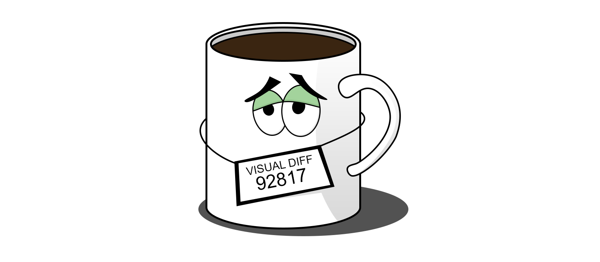
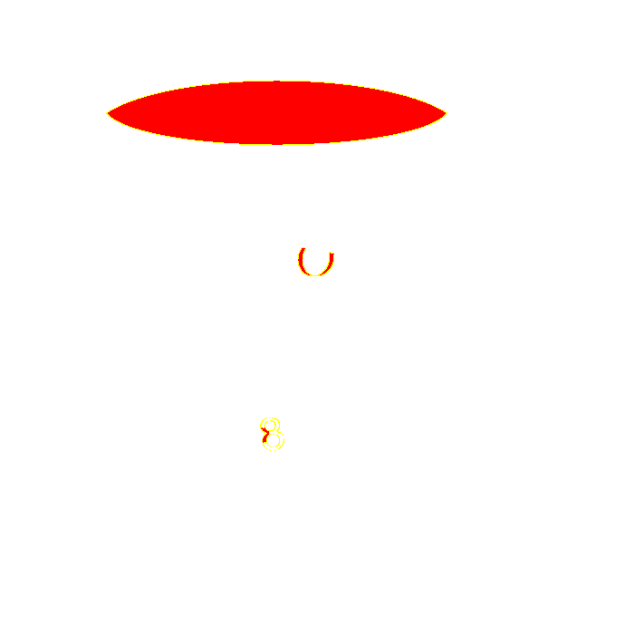

<div align="center">
<h2>Framework independent visual testing library</h2>

[](https://travis-ci.com/NiGhTTraX/mugshot) [](https://codecov.io/gh/NiGhTTraX/mugshot) 
</div>

----

Mugshot is a node library for doing visual regression testing. The way screenshots are taken, processed, compared and stored is entirely customizable. You can use it to write visual regression tests for websites, mobile apps, native apps etc. Moreover, Mugshot doesn't impose any preferences on how you write or execute the tests, it just gives you an assertion that you can call however and whenever you want.

<div align="center">
<a href="http://nighttrax.github.io/mugshot">View API docs</a>
</div>

----

<!-- START doctoc generated TOC please keep comment here to allow auto update -->
<!-- DON'T EDIT THIS SECTION, INSTEAD RE-RUN doctoc TO UPDATE -->
**Table of content**

- [Features](#features)
- [Installation](#installation)
- [Motivation](#motivation)
- [Docs](#docs)
- [Contributing](#contributing)
- [License](#license)

<!-- END doctoc generated TOC please keep comment here to allow auto update -->

## Features

- Framework independent so you can choose your favorite tools or plug it into your existing testing suite.
- Produces diff images if a test fails.
- Throws on missing baselines (can be toggled through options).
- Everything is pluggable (screenshotter, differ, storage etc.).


## Installation

```shell script
npm install --save-dev mugshot
```

Or alternatively with yarn

```shell script
yarn add -D mugshot
```

Depending on how you want to take screenshots, you'll need a [`Screenshotter`](./docs/interfaces/screenshotter.html) implementation. Mugshot bundles a [`BrowserScreenshotter`](./docs/classes/browserscreenshotter.html) that you can use with Webdriver compatible browsers. Each browser might need an adapter that translates its API to the interface that Mugshot expects. The following adapters are available:

Package | Version
--------|--------
[@mugshot/webdriverio](./packages/webdriverio) | 
[@mugshot/puppeteer](./packages/puppeteer) | 

## Motivation

Manually checking one component for unexpected visual changes is hard. Doing it across your entire UI is harder. Doing it in multiple browsers/devices is even harder. Making sure that everyone on your team does it is the hardest.

Mugshot aims to automate that process. It offers a simple API that lets you compare an existing baseline screenshot with a fresh screenshot and make sure they're identical. If they're not you'll get a diff image highlighting the differences. You can then commit it as the new baseline if the changes are expected, or fix the code and rerun the tests.

Expected | Actual | Diff
---------|--------|-----
 |  | 


## Docs

[View the API docs](http://nighttrax.github.io/mugshot) | [Edit the docs](./CONTRIBUTING.md#edit-the-docs)


## Contributing

See the [CONTRIBUTING](./CONTRIBUTING.md) guide.


## License

[MIT](./LICENSE)
