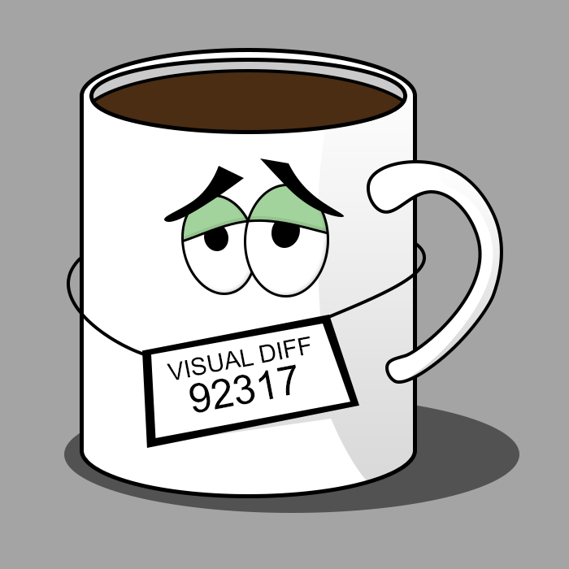
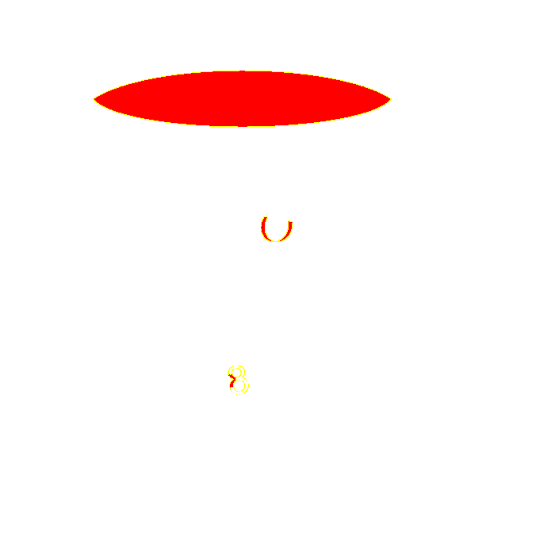

> Framework independent visual testing library

[](https://travis-ci.com/NiGhTTraX/mugshot) [](https://codecov.io/gh/NiGhTTraX/mugshot)

----

> NOTICE: this project was previously hosted at [@uberVU](https://github.com/uberVU) but has been transferred to [@NiGhTTraX](https://github.com/NiGhTTraX). The licensing has not changed. The last version before the migration is `mugshot@0.3.2.`.


## Features

- Framework independent so you can choose your favorite tools or plug it into your existing testing suite.
- Can screenshot the whole viewport or just an element.
- Produces actual and diff images if a test fails.
- Can work with any Webdriver implementation through an adapter.
- Fails if baselines are missing (can be toggled through options).


## Intro

Manually checking one component for unexpected visual changes is hard. Doing it across your entire UI is harder. Doing it in multiple browsers is even harder. Making sure that everyone on your team does it is the hardest.

Mugshot aims to automate that process. It offers a simple API that lets you compare an existing baseline screenshot with a fresh screenshot taken from a browser instance and make sure they're identical. If they're not you'll get a diff image highlighting the differences. You can then commit them as the new baseline if they're expected, or fix the code and rerun the tests.

Expected | Actual | Diff
---------|--------|-----
 |  | 

If you have an existing testing suite then it will be straightforward to add Mugshot to it. If you're starting from scratch with browser testing then you can choose your favorite tools, Mugshot doesn't impose anything on you. You will have full control over how you spin up browsers and how you control them. 

You can think of Mugshot as providing an assertion - "expect this part of the UI to look the same as last time". A visual test would typically look like:

1. Open the browser.
2. Navigate to an URL.
3. Interact with the UI (scroll, click a button, input some text in a form etc.).
4. Run the Mugshot assertion.


## Reducing flakiness

A frequent source of flakiness in visual tests is dynamic data e.g. the current date or live API data. You can ignore elements that contain such data by by painting over them with a solid color square. See the [ignore option](./packages/mugshot/README.md#ignoring-elements) for more details.

Other common sources are animations and the blinking cursor in input fields. There is a planned feature where Mugshot will inject a stylesheet into your page to try to turn them off, but until then you can do it manually by including something along the following lines:

```css
input {
  caret-color: transparent;
}

*, *::before, *::after {
  transition: none !important;
  animation: none !important;
}
```


## Packages

Package | Version
--------|--------
[mugshot](./packages/mugshot) | 
[@mugshot/webdriverio](./packages/webdriverio) | 
