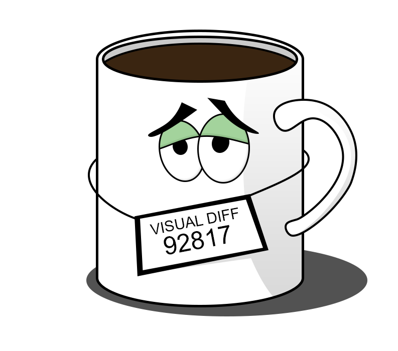

<!--suppress HtmlDeprecatedAttribute -->
<div align="center">



<h2>Framework independent visual testing library</h2>

[](https://github.com/NiGhTTraX/mugshot/actions/workflows/ci.yml)
[](https://codecov.io/gh/NiGhTTraX/mugshot)

[](LICENSE)

</div>

----

Mugshot is a node library for doing visual regression testing. The way screenshots are taken, processed, compared and stored is entirely customizable. You can use it to write visual regression tests for websites, mobile apps, native apps etc. Moreover, Mugshot doesn't impose any preferences on how you write or execute the tests, it just gives you an assertion that you can call however and whenever you want.

<!--suppress HtmlDeprecatedAttribute -->
<div align="center">
<a href="https://nighttrax.github.io/mugshot">View API docs</a>
</div>

----

## Features

- Framework independent so you can choose your favorite tools or plug it into your existing testing suite.
- Produces diff images if a test fails.
- Throws on missing baselines (can be toggled through options).
- Everything is pluggable (screenshotter, differ, storage etc.).


## Installation

<!-- DUPLICATED in website/docs/usage.md. Please keep in sync. -->

```console
npm install --save-dev mugshot
```

Or with yarn

```console
yarn add -D mugshot
```

Depending on how you want to take screenshots, you'll need a [`Screenshotter`](https://nighttrax.github.io/mugshot/api/interfaces/mugshot.screenshotter) implementation. Mugshot bundles a [`WebdriverScreenshotter`](https://nighttrax.github.io/mugshot/api/classes/mugshot.webdriverscreenshotter) that you can use with Webdriver compatible clients e.g. [Selenium](https://selenium.dev/) or [Appium](http://appium.io/). Each client might need an adapter that translates its API to the interface that Mugshot expects. The following adapters are available:

Package | Version
--------|--------
[@mugshot/webdriverio](packages/webdriverio) | 
[@mugshot/puppeteer](packages/puppeteer) | 
[@mugshot/playwright](packages/playwright) | 


## Motivation

Manually checking one component for unexpected visual changes is hard. Doing it across your entire UI is harder. Doing it in multiple browsers/devices is even harder. Making sure everyone on your team does it is the hardest.

Mugshot aims to automate that process. It offers a simple API that lets you compare an existing baseline screenshot with a fresh screenshot and make sure they're identical. If they're not you'll get a diff image highlighting the differences. You can then commit it as the new baseline if the changes are expected, or fix the code and rerun the tests.

Expected | Actual | Diff
---------|--------|-----
 |  | 

## License

[MIT](LICENSE)
