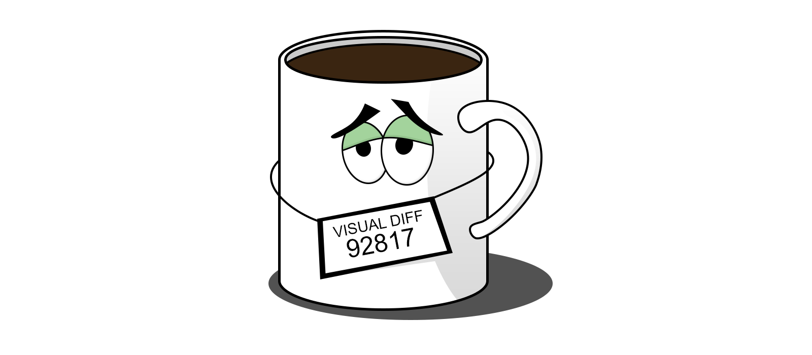

> Framework independent visual testing library

## Usage

Mugshot doesn't aim to replace your testing framework. It aims to add visual testing capabilities to it. As such, you have full control over how you spin up browsers and how you control them. When you've reached the desired state (browser open, navigated to page, scrolled to element, hovered over tooltip, dropdown opened etc.) you can then use Mugshot to take a screenshot and compare it to your baseline.

Since different Webdriver libraries have different API and semantics, you will most likely need a wrapper over it to pass it to Mugshot. Below is an example of using the [WebdriverIO](https://webdriver.io/) adapter:

```typescript
import Mugshot from 'mugshot';
import WebdriverIOAdapter from '@mugshot/webdriverio';
import path from 'path';

(async () => {
  const browser = await remote({
    hostname: 'localhost',
    capabilities: { browserName: 'chrome' }
  });
  
  const mugshot = new Mugshot(
    WebdriverIOAdapter(browser),
    path.join(__dirname, 'screenshots')
  );
  
  await browser.url('https://github.com/NiGhTTraX/mugshot');
  
  const result = await mugshot.check('whole-page');
  
  console.log(result.matches);
})();
```
